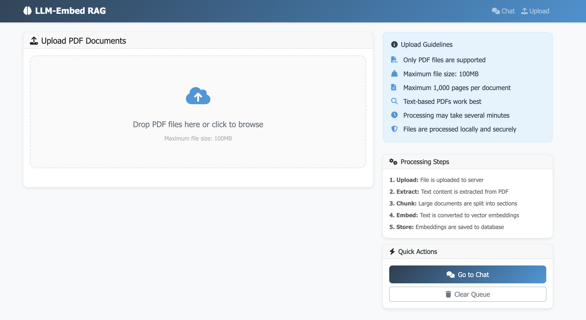

# LLM-Embed: Document Query System with RAG

Welcome! This repository contains a complete document question-answering system that lets you upload PDF documents and then ask questions about them using AI. The system uses Retrieval-Augmented Generation (RAG) to provide accurate, contextual answers based on your documents.

## How It Works

Think of this as your personal research assistant that can read through your documents and answer questions about them. Here's the simple process:

1. **Upload Documents**: You give the system PDF files to read and understand
2. **Ask Questions**: You ask questions in natural language about those documents  
3. **Get Answers**: The AI provides answers based specifically on your document content

The system works by converting your documents into mathematical representations (vectors) that capture their meaning, then finding the most relevant parts when you ask questions.

## System Components

This repository contains four main parts that work together:

### 1. Document Processing (`upload_and_embed_pdf.py`)

This script takes your PDF files and prepares them for the AI system. It:
- Reads PDF files and extracts all the text content
- Breaks large documents into smaller, manageable chunks
- Converts the text into numerical vectors that capture meaning
- Stores everything in a searchable database

This part teachs the system to "read" and "understand" your documents.

### 2. Question Answering (`query_documents.py`)

This script lets you ask questions about your uploaded documents. It:
- Takes your question and converts it to the same vector format
- Searches through your documents to find the most relevant sections
- Combines the relevant content with your question
- Uses AI to generate a comprehensive answer

This will initiate the AI Assistant which can instantly find and summarize relevant information.

### 3. Web Interface (`web_app.py`)

This provides a user-friendly browser interface that combines both document upload and question answering in one place. It:
- Offers a clean chat interface for asking questions
- Provides drag-and-drop file upload with progress tracking
- Shows real-time processing status
- Displays conversation history and source attribution

**Think of this as**: A complete web application that makes the system accessible to anyone through their browser.


*Drag and drop interface for easy document upload*


*Interactive chat interface for asking questions about your documents*

### 4. Supporting Documentation

- `README_MAC_SETUP.md`: Complete setup instructions for macOS
- `SCRIPT_USAGE.md`: Detailed guide for uploading documents
- `QUERY_USAGE.md`: Detailed guide for asking questions
- `WEB_INTERFACE_GUIDE.md`: Complete guide for using the web interface

## Quick Start Guide

### Prerequisites

You'll need to have Ollama running with the qwen3:0.6b model. The `README_MAC_SETUP.md` file has complete installation instructions, but here's the short version:

```bash
# Install and start Ollama with Docker
docker run -d -v ollama:/root/.ollama -p 11434:11434 --name ollama ollama/ollama
docker exec ollama ollama pull qwen3:0.6b
```

### Basic Workflow

1. **Set up your environment** (one time only):
```bash
python3 -m venv .venv
source .venv/bin/activate
pip install -r requirements.txt
```

2. **Upload a document** (repeat for each PDF):
```bash
python3 upload_and_embed_pdf.py /path/to/your/document.pdf
```

3. **Ask questions** - you have two options:

**Option A: Use the web interface** (recommended for most users):
```bash
python3 web_app.py
```
Then open your browser to `http://localhost:5000` for a complete web interface.

**Option B: Use command line**:
```bash
python3 query_documents.py "What is the main topic of the document?"
```

Or start an interactive conversation:
```bash
python3 query_documents.py --interactive
```

## Detailed Usage Examples

### Using the Web Interface (Recommended)

The easiest way to use the system is through the web interface:

```bash
python3 web_app.py
```

Then open `http://localhost:5000` in your browser. The web interface provides:
- **Upload Page**: Drag-and-drop PDF upload with progress tracking
- **Chat Interface**: Ask questions with a clean, easy-to-use chat interface
- **Real-time Status**: See processing progress and system status
- **Source Attribution**: Know which documents your answers come from

### Command Line Usage

### Uploading Different Types of Documents

```bash
# Upload a research paper
python3 upload_and_embed_pdf.py ~/Documents/research_paper.pdf

# Upload an experiment protocol 
python3 upload_and_embed_pdf.py ~/Downloads/protocol_rna_extraction.pdf

# Upload with verbose logging to see progress
python3 upload_and_embed_pdf.py --verbose ~/Documents/report.pdf
```

### Asking Different Types of Questions

```bash
# Ask about main topics
python3 query_documents.py "What are the key findings?"

# Ask for specific information  
python3 query_documents.py "What methodology was used in this study?"

# Ask for practical information
python3 query_documents.py "How do I configure the system?"

# Get more context by retrieving more document chunks
python3 query_documents.py --max-results 5 "What are all the requirements?"
```

### Interactive Mode

For a conversation-like experience:

```bash
python3 query_documents.py --interactive
```

This starts a chat interface where you can ask follow-up questions and explore your documents naturally.

## Understanding the Technology

### What is RAG (Retrieval-Augmented Generation)?

RAG is a method that combines document search with AI text generation. Instead of the AI making up answers, it:

1. **Retrieval**: Finds relevant sections from your actual documents
2. **Augmentation**: Combines those sections with your question  
3. **Generation**: Uses AI to synthesize a comprehensive answer

This means you get answers that are grounded in your specific documents, not general knowledge.

### Why Use Vector Embeddings?

Traditional search looks for exact word matches. Vector embeddings understand meaning and context. For example:
- Traditional search: "car" won't find "automobile" or "vehicle"
- Vector search: Understands these words are related and finds relevant content

This makes the system much better at understanding what you're really asking about.

## File Structure

After setting up, your directory will look like this:

```
llm-embed/
├── upload_and_embed_pdf.py    # Script to process PDF documents
├── query_documents.py         # Script to ask questions
├── web_app.py                 # Web interface application
├── templates/                 # HTML templates for web interface
│   ├── base.html             # Base template
│   ├── index.html            # Chat interface
│   └── upload.html           # Upload page
├── requirements.txt           # Python dependencies
├── README_MAC_SETUP.md        # Installation instructions
├── SCRIPT_USAGE.md           # Upload script documentation  
├── QUERY_USAGE.md            # Query script documentation
├── WEB_INTERFACE_GUIDE.md    # Web interface guide
├── chromadb_storage/         # Database where document vectors are stored
└── your_documents.pdf        # Your uploaded PDF files
```

## Performance and Limitations

### What Works Well
- Documents up to 100MB in size
- PDFs with clear text content (not just images)
- Technical documents, research papers, manuals, reports
- Questions about specific content in your documents

### Current Limitations
- Only processes PDF files (not Word docs, web pages, etc.)
- Works best with text-based PDFs (scanned images may not work well)
- CPU-only processing (slower than GPU but still effective)
- Maximum 1000 pages per document

### Tips for Best Results
- Use clear, specific questions
- If you don't get good results, try rephrasing your question
- For large documents, the system automatically breaks them into chunks
- Multiple shorter documents often work better than one very long document

## Troubleshooting Common Issues

### "ChromaDB storage not found"
You need to upload documents first:
```bash
python3 upload_and_embed_pdf.py /path/to/document.pdf
```

### "No relevant documents found"
- Try different keywords or phrasing
- Make sure your documents contain information related to your question
- Use `--verbose` to see what the system is finding

### "Connection refused" errors
Make sure Ollama is running:
```bash
docker ps  # Should show ollama container
docker start ollama  # If it's not running
```

### PDF processing issues
- Make sure the PDF file exists and isn't corrupted
- Try using `--verbose` to see detailed processing information
- Very large files may need to be split into smaller parts

## Getting Help

If you run into issues:

1. **Check the detailed documentation**: Each script has its own detailed usage guide
2. **Use verbose mode**: Add `--verbose` to see what's happening
3. **Verify prerequisites**: Make sure Ollama is running and models are downloaded
4. **Check file paths**: Ensure your PDF files exist and are accessible

## Advanced Usage

### Batch Processing Multiple Documents

```bash
# Process all PDFs in a directory
for pdf in *.pdf; do
    python3 upload_and_embed_pdf.py "$pdf"
done
```

### Using Different Models

The system is configured to use `qwen3:0.6b` for both embedding and chat, which works well on CPU. If you have other models available in Ollama, you can modify the model names in the script configuration sections.

### Customizing Behavior

Both scripts have configuration constants at the top that you can modify:
- Chunk sizes for document processing
- Number of results returned from searches  
- Context limits for AI responses
- Database storage locations

## Contributing and Extending

This system is designed to be easily understandable and modifiable. The code includes extensive comments explaining how each part works. Feel free to:

- Modify the scripts for your specific needs
- Add support for other document types
- Experiment with different AI models
- Enhance the user interface

The goal is to provide a solid foundation that you can build upon for your specific use cases.

---

I hope this system helps you work more effectively with your documents. The combination of semantic search and AI generation can be quite powerful for research, analysis, and information retrieval tasks.
